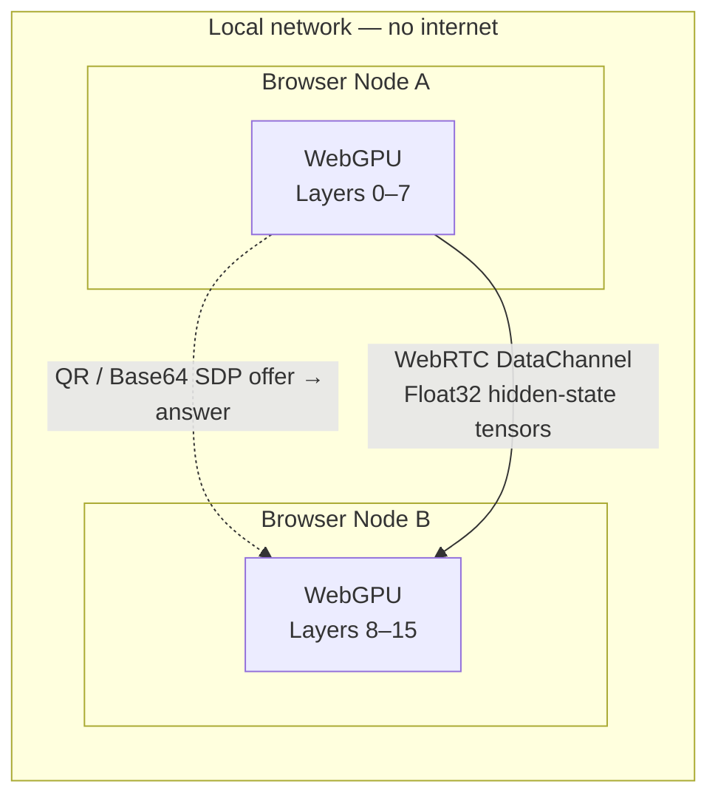

# MeshGPU

### Air-Gapped, Serverless WebGPU Inference Pooling Over Local Wi-Fi

MeshGPU pools the VRAM of every WebGPU-capable device on your local network
into a single **browser-native inference cluster**. Two or more tabs (or
machines) shard a transformer model's layers across their GPUs and stream
hidden-state tensors between them over **WebRTC DataChannels** — with **no
server, no cloud, and no network traversal**.

There is nothing to sign up for, nothing to deploy, and no data leaves your
LAN: peers pair by scanning a QR code or copy-pasting a Base64 SDP string.

---

## Why MeshGPU

| | |
| --- | --- |
| 🔒 **100% Air-Gapped** | Zero server data traversal. Prompt tokens, intermediate tensors and generated output never touch the internet. |
| ⚡ **Zero-Setup Browser Runtime** | Open two tabs and pair them. No backend, no `docker`, no signup — just a modern browser. |
| 📱 **Serverless QR/Base64 Handshakes** | WebRTC offers/answers are compressed with LZ-String and exchanged by camera scan or clipboard. |
| 🧠 **Automatic VRAM Pooling** | Each peer advertises its GPU's VRAM and a throughput score; a deterministic scheduler partitions the model into contiguous layer ranges. |

---

## Architecture

Two local browser nodes run WebGPU layer-sharding and exchange tensors over a
direct WebRTC DataChannel. The only thing that crosses the air gap is the
one-time SDP handshake.



```
┌───────────────────────────── local network ─────────────────────────────┐
│                                                                          │
│   ┌─ Node A ─────────────┐         ┌─ Node B ─────────────┐              │
│   │  WebGPU · Layers 0–7 │◄─ QR ──►│  WebGPU · Layers 8–15│              │
│   └──────────┬───────────┘         └──────────┬───────────┘              │
│              │    WebRTC DataChannel          │                          │
│              └──────── Float32 tensors ───────┘                          │
│                                                                          │
└──────────────────────────────────────────────────────────────────────────┘
```

1. **Capability inspection** — each tab requests a `GPUAdapter`, reads its
   limits/features, estimates its VRAM pool, and computes how many transformer
   layers it can host.
2. **Manual handshake** — the host renders a room-offer QR; the joiner scans
   it and returns a guest-answer QR. ICE candidates are gathered to
   `complete` and bundled into a single compressed string.
3. **Tensor streaming** — the first stage executes, streams the hidden state
   to the next stage over an unordered, no-retransmit DataChannel, and the
   final stage produces the output token.

---

## Quickstart

Prerequisites: **Node.js ≥ 18** and a WebGPU-capable browser
(Chrome/Edge stable, Firefox Nightly, or Safari Technology Preview). WebGPU
requires a secure context — `http://localhost` qualifies.

```bash
git clone https://github.com/<your-org>/mesh-gpu.git
cd mesh-gpu
npm install
npm run dev          # → http://localhost:5173
```

The dashboard probes your GPU, shows its adapter limits, ML-relevant features,
estimated VRAM pool, and how many layers of each model profile this node can
host.

---

## Air-Gapped P2P Setup Guide

Pair two tabs (same machine) or two devices (same Wi-Fi) in under a minute.

### Option A — QR code camera scanning

1. Open `http://localhost:5173` in two browser tabs/devices on the **same LAN**.
2. In each tab, open **P2P Pipeline → Connect peers (QR)**.
3. **Host tab** (first device): click **Generate room offer**, then hold the
   QR code up to the other device's camera.
4. **Joiner tab** (second device): click **Scan with camera**. The offer is
   decoded automatically and a **guest answer** QR appears.
5. Back on the host: click **Scan with camera** to read the guest answer and
   apply it.
6. Watch the connection status turn **Connected** — latency and layer
   assignment appear once the DataChannels open.

### Option B — Base64 copy-paste (no camera)

1. **Host tab**: click **Generate room offer**, then **Copy** the Base64 text
   and send it to the joiner (AirDrop, chat, sticky note — anything).
2. **Joiner tab**: paste the offer into **Paste/scan host offer** and click
   **Accept offer & generate answer**; copy the answer.
3. **Host tab**: paste the answer into **Paste/scan guest answer** and click
   **Apply guest answer**.

> If camera access is denied, the modal automatically falls back to the
> copy-paste input — the handshake works identically either way.

When both peers are connected, the scheduler assigns each device a contiguous
layer range and the tab owning layer 0 can run **Run identity tensor** to
exercise the full pipeline.

---

## Technical Stack

| Layer | Technology |
| ----- | ---------- |
| UI & runtime | **React 18 + Vite 5**, Tailwind CSS |
| Language | **TypeScript** (strict) |
| Compute | **WebGPU** (`@webgpu/types`) — shader-ready layer executor interface |
| Reference inference | **@mlc-ai/web-llm** (single-node baseline) |
| Peer transport | **WebRTC DataChannels** (ordered control + unordered tensor channel) |
| Handshake | Manual SDP exchange compressed with **LZ-String** |
| QR | **qrcode.react** (render) + **html5-qrcode** (camera scan) |
| Testing | **Playwright** + in-memory MockTransport runner |

```
src/
├── engine/
│   ├── webgpu-node.ts      # GPUAdapter inspection, VRAM estimation, layer allocation
│   ├── manual-signaling.ts # Manual WebRTC SDP exchange (QR / Base64)
│   ├── signaling.ts        # Transport-agnostic signaling contracts
│   ├── p2p-pipeline.ts     # WebRTC DataChannel tensor streaming + scheduler hooks
│   ├── scheduler.ts        # Deterministic throughput-weighted layer assignment
│   ├── mock-transport.ts   # In-memory RTC/DataChannel mock (headless tests)
│   └── web-llm.ts          # @mlc-ai/web-llm runtime (single-node baseline)
├── components/
│   ├── QRHandshakeModal.tsx# Host/joiner QR handshake workflow
│   ├── TopologyGraph.tsx   # Canvas node graph: peers, layers, VRAM, RTT
│   ├── VramGauge.tsx       # Semicircular VRAM pool gauge
│   └── ChatUI.tsx          # Local streaming chat (WebLLM)
└── App.tsx
```

---

## Security & Privacy Guarantee

MeshGPU is engineered so that **zero prompt tokens and zero intermediate model
tensors ever leave your local network**:

- **No signaling server** — WebRTC offers/answers are exchanged directly
  between browsers via QR code or clipboard. There is no room registry, no
  message relay, and nothing to eavesdrop on.
- **Host candidates only** — the ICE configuration is `{ iceServers: [] }`, so
  the DataChannel connects over your local Wi-Fi/Ethernet subnet without STUN
  or TURN and without contacting any external endpoint.
- **Model data stays put** — weights are loaded locally; only the
  `Float32Array` hidden-state tensors move between peers, and only within the
  LAN.
- **Source-available under AGPL-3.0** — see [LICENSE](LICENSE). Hosting a
  modified MeshGPU as a network service requires you to release your source
  changes back to the community.

> Security is a process, not a promise. Treat any browser extension, devtool
> or OS-level observer as out of scope; MeshGPU guarantees what the runtime
> itself transmits — and it transmits nothing beyond the LAN.

---

## Development

```bash
npm install
npm run typecheck        # tsc --noEmit (app + node configs)
npm run test:e2e:manual  # Playwright: manual handshake + MockTransport tensor streaming
npm run build            # production build → dist/
```

Enable the in-memory mock (no real WebRTC) with `?mockP2P=true` or
`VITE_USE_MOCK_P2P=true` — used by the **Mock P2P Mesh** demo card and the
headless CI suite.

## Contributing

Please read [CONTRIBUTING.md](CONTRIBUTING.md) before opening a pull request.
All contributors must agree to the [Contributor License Agreement](CLA.md),
which assigns copyright of contributed changes to the project maintainer.

## License

MeshGPU is licensed under the **GNU Affero General Public License v3.0
(AGPL-3.0-only)**. See [LICENSE](LICENSE) for the full text.
