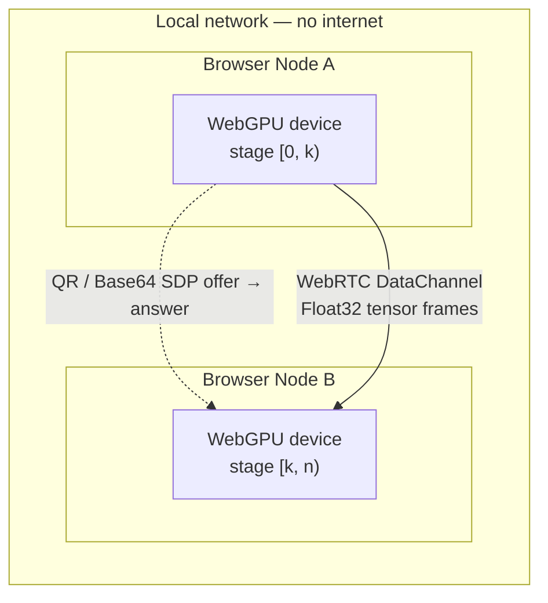

# MeshGPU

### A serverless, LAN-only tensor transport for browser GPUs

MeshGPU pairs WebGPU-capable browsers on the same local network into a
peer-to-peer mesh and streams tensors between them over WebRTC DataChannels —
with no signaling server, no cloud, and no traffic leaving your subnet. Peers
pair by scanning a QR code or copy-pasting a compressed SDP string.

> ### Status: early. Read this before you try it.
>
> **Sharded inference is not implemented yet.** The transport, the handshake
> and the layer scheduler all work and are tested. What travels between peers
> today is produced by an *identity executor* — it forwards tensors unchanged.
> No transformer layer executes on any remote peer.
>
> The only place a real model runs is the single-node chat card, which uses
> [WebLLM](https://github.com/mlc-ai/web-llm) on one device. See
> [Roadmap](#roadmap) for what it would take to close that gap, and
> [Honest limitations](#honest-limitations) for what this cannot do even once
> it is closed.

---

## What actually works today

| | Status | |
| --- | --- | --- |
| **WebGPU capability probing** | ✅ Works | Adapter limits, ML-relevant features, compute + bandwidth micro-benchmarks |
| **Serverless pairing** | ✅ Works | Full SDP + ICE candidates compressed into one QR code or Base64 string |
| **Binary tensor transport** | ✅ Works | 32-byte framed wire format over a dedicated DataChannel, round-trip tested |
| **Layer scheduler** | ✅ Works | Deterministic, throughput-weighted, memory-capped assignment (2 peers) |
| **Single-node inference** | ✅ Works | WebLLM chat on your own GPU — this is real inference, on one device |
| **VRAM estimation** | ⚠️ Approximate | Parsed from the adapter description; often unavailable (see limitations) |
| **Multi-peer mesh (3+)** | ❌ Not yet | Peer IDs are fixed to `host`/`joiner`; pairing a third device is unsupported |
| **Sharded inference** | ❌ Not yet | `IdentityExecutor` is the only executor in the codebase |

---

## Architecture

Two browser nodes pair directly and exchange tensors over a WebRTC
DataChannel. The only thing crossing the gap is a one-time SDP handshake that
you carry across by hand.



1. **Capability inspection** — each tab requests a `GPUAdapter`, reads its
   limits and features, runs a 2-second compute/bandwidth benchmark, and
   estimates how many transformer layers it could host.
2. **Manual handshake** — the host renders a room-offer QR; the joiner scans it
   and returns a guest-answer QR. ICE candidates are gathered to `complete` and
   bundled into a single compressed string. No server is involved at any point.
3. **Tensor streaming** — the first stage runs its executor, streams the result
   to the next stage, and the final stage produces an output. *Today that
   executor is the identity function.*

---

## Quickstart

Prerequisites: **Node.js ≥ 18** and a WebGPU-capable browser. Chrome or Edge
stable is strongly recommended — Firefox's WebGPU dispatch overhead is roughly
30× Chrome's and is not usable for inference. WebGPU requires a secure
context; `http://localhost` qualifies.

```bash
git clone https://github.com/<your-org>/mesh-gpu.git
cd mesh-gpu
npm install
npm run dev
```

Then open `http://localhost:5173`. The dashboard probes your GPU and shows its
adapter limits, ML-relevant features, estimated memory pool, and how many
layers of each model profile this node could host.

---

## Pairing two devices

Pair two tabs (same machine) or two devices (same Wi-Fi) in under a minute.

### Option A — QR code camera scanning

1. Open the app in two browser tabs or devices on the **same LAN**.
2. In each, open **P2P Transport Loopback → Connect peers (QR)**.
3. **Host**: click **Generate room offer**, then hold the QR up to the other
   device's camera.
4. **Joiner**: click **Scan with camera**. The offer decodes automatically and
   a **guest answer** QR appears.
5. **Host**: click **Scan with camera** to read the guest answer and apply it.
6. The status turns **Connected**; latency and layer assignment appear once the
   DataChannels open.

### Option B — Base64 copy-paste (no camera)

1. **Host**: **Generate room offer**, then **Copy** the Base64 text and send it
   to the joiner by any means.
2. **Joiner**: paste it into **Paste/scan host offer**, click **Accept offer &
   generate answer**, copy the answer.
3. **Host**: paste the answer into **Paste/scan guest answer** and click
   **Apply guest answer**.

If camera access is denied, the modal falls back to copy-paste automatically.

Once connected, **Run loopback tensor** pushes a small `Float32Array` through
the full transport path — encode, send, receive, validate, forward, return.
This exercises the wire format end to end. It does not run a model.

---

## Honest limitations

Worth understanding before you build on this, because some of these are
properties of the approach rather than bugs to be fixed.

**Layer sharding buys capacity, not speed.** Autoregressive decode is
memory-bandwidth bound. Splitting a model across *N* machines gives each one
1/*N* of the weights to read — but also 1/*N* of the bandwidth, and the stages
run sequentially. Ten laptops running a 30B model land at roughly the same
tokens/second as one hypothetical machine that could hold the whole thing. The
win is that the model runs at all, on hardware that individually could not
hold it. Anyone promising a speedup from pipeline parallelism at batch size 1
is mistaken.

**The payoff needs concurrent users.** At batch 1, all but one stage sits idle.
With several people querying at once, every stage stays busy and aggregate
throughput scales with the number of stages. A shared office mesh is the
deployment shape where this actually pays off; one person pooling their own
laptop and desktop gains nothing.

**Bandwidth is not the bottleneck; prefill is.** A 7B model's hidden state is
about 14 KB per token per hop — roughly 7 Mbps at 20 tok/s across three hops,
which any Wi-Fi handles. Prefill is the hard part: a 2,048-token prompt is
~29 MB per hop in f32, and the current transport has no frame chunking, so
that path is not yet viable.

**Browsers are slower than native.** WebLLM reaches around 80% of native MLC
throughput on premium hardware and considerably less elsewhere; prefill lags
native by 21–51%. The browser's advantage here is deployment — no install, no
admin rights, works on a locked-down laptop — not performance. If you control
the machines, [exo](https://github.com/exo-explore/exo) and
[llama.cpp](https://github.com/ggml-org/llama.cpp) will be faster.

**VRAM estimates are approximations.** Browsers do not expose dedicated VRAM.
MeshGPU parses `GPUAdapterInfo.description` against a hardcoded device table,
falling back to `navigator.deviceMemory`. Chrome frequently returns empty
strings for these fields, in which case no estimate is available and the node
reports zero capacity. Even a correct answer overstates what a browser tab can
actually allocate — `maxBufferSize` is typically capped near 2 GiB and the
per-process GPU budget is well below the card's physical memory. Treat these
numbers as indicative.

**Pairing is unauthenticated.** Anyone who can see or photograph the offer QR
can join. There is no shared secret, no peer identity, and no revocation. Use
this only on networks and with people you already trust.

---

## Privacy properties

What MeshGPU does and does not guarantee, stated precisely:

- **No signaling server.** Offers and answers move between browsers by QR code
  or clipboard. There is no room registry and no message relay.
- **Host candidates only.** The manual handshake uses `{ iceServers: [] }`, so
  the DataChannel connects over your local subnet without contacting STUN or
  TURN. *(`DEFAULT_RTC_CONFIG` in the codebase does reference a public STUN
  server; it is reachable only from the mock-transport test path, never from
  the QR handshake the app actually uses.)*
- **Model weights stay local.** Weights are downloaded to the device that runs
  them. Only tensor frames move between peers, and only within the LAN.
- **Source-available under AGPL-3.0.** Hosting a modified MeshGPU as a network
  service requires releasing your changes.

Security is a process, not a promise. Browser extensions, devtools and
OS-level observers are out of scope. MeshGPU can only speak for what its own
runtime transmits — and, on the QR path, that is nothing beyond your subnet.

---

## Roadmap

Ordered by what unblocks the most.

**Next — make it useful without sharding.** Every peer loads a whole model and
requests route to whichever node is idle. This is data parallelism: it scales
linearly with peers, tolerates a machine disappearing mid-request, needs no
tensor streaming, and works on today's dependencies. Paired with an
OpenAI-compatible endpoint, it turns MeshGPU from a demo into something you can
point an existing tool at.

**Then — transport hardening.** Frame chunking and an f16 wire format so
prefill-sized tensors survive the DataChannel; retransmit deadlines so a
dropped frame cannot stall a forward pass indefinitely; honouring the
backpressure signal instead of dropping frames silently.

**Then — real sharded inference.** WebLLM's public API runs whole models and
cannot express per-layer execution, so this means ONNX Runtime Web with a
manually split graph, or a purpose-built WGSL kernel set — plus a sharded KV
cache, which is the part most people underestimate.

**Also needed** — mesh support beyond two peers with real peer identities and
capacity gossip; authenticated pairing; empirical memory probing to replace the
device lookup table; microbatching so concurrent requests fill the pipeline.

---

## Technical stack

| Layer | Technology |
| ----- | ---------- |
| UI & runtime | **React 18 + Vite 5**, Tailwind CSS |
| Language | **TypeScript** (strict) |
| Compute | **WebGPU** (`@webgpu/types`) — benchmark kernels + executor interface |
| Reference inference | **@mlc-ai/web-llm** (single-node only) |
| Peer transport | **WebRTC DataChannels** (ordered control + unordered tensor) |
| Handshake | Manual SDP exchange compressed with **LZ-String** |
| QR | **qrcode.react** (render) + **html5-qrcode** (camera scan) |
| Testing | **Vitest** (unit) + **Playwright** with an in-memory MockTransport |

```
src/
├── engine/
│   ├── webgpu-node.ts       # Adapter inspection, VRAM estimation, benchmarks
│   ├── manual-signaling.ts  # Manual WebRTC SDP exchange (QR / Base64)
│   ├── signaling.ts         # Transport-agnostic signaling contracts
│   ├── p2p-pipeline.ts      # DataChannel tensor streaming + forwarding
│   ├── scheduler.ts         # Deterministic throughput-weighted assignment
│   ├── mock-transport.ts    # In-memory RTC mock (headless tests)
│   ├── web-llm.ts           # Single-node WebLLM runtime
│   ├── scheduler.test.ts    # Scheduler invariants + randomised properties
│   └── tensor-codec.test.ts # Wire format round-trip + malformed-input tests
├── components/
│   ├── QRHandshakeModal.tsx # Host/joiner QR handshake workflow
│   ├── TopologyGraph.tsx    # Canvas node graph: peers, stages, VRAM, RTT
│   ├── VramGauge.tsx        # Semicircular memory gauge
│   └── ChatUI.tsx           # Local streaming chat (WebLLM, single node)
└── App.tsx
```

---

## Development

```bash
npm install
npm run typecheck        # tsc --noEmit (app + node configs)
npm test                 # Vitest: wire format + scheduler invariants
npm run test:e2e:manual  # Playwright: manual handshake + MockTransport streaming
npm run build            # typecheck + production build → dist/
```

Enable the in-memory mock transport (no real WebRTC) with `?mockP2P=true` or
`VITE_USE_MOCK_P2P=true` — used by the **Mock P2P Mesh** demo card and the
headless CI suite.

## Contributing

Please read [CONTRIBUTING.md](CONTRIBUTING.md) before opening a pull request.
Contributions require agreeing to the
[Contributor License Agreement](CLA.md).

The most valuable contributions right now are the roadmap items above,
especially anything that makes a real model execute across two peers.

## License

MeshGPU is licensed under the **GNU Affero General Public License v3.0
(AGPL-3.0-only)**. See [LICENSE](LICENSE) for the full text.
