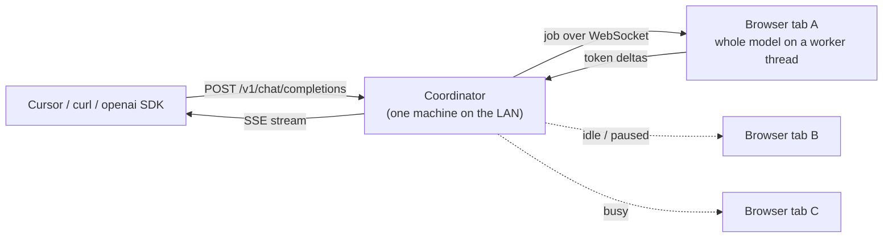
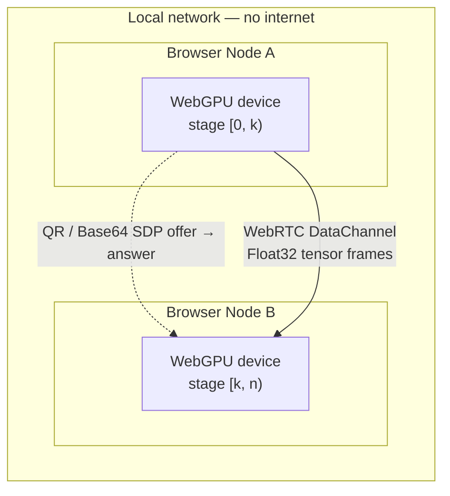

# MeshGPU

### A serverless, LAN-only tensor transport for browser GPUs

MeshGPU pairs WebGPU-capable browsers on the same local network into a
peer-to-peer mesh and streams tensors between them over WebRTC DataChannels —
with no signaling server, no cloud, and no traffic leaving your subnet. Peers
pair by scanning a QR code or copy-pasting a compressed SDP string.

MeshGPU has two modes, and they are very different in maturity:

> ### **Pool mode — works today.**
> Each contributing browser tab loads a whole model and answers requests routed
> to it by a small on-prem coordinator, which exposes an **OpenAI-compatible
> endpoint**. Point Cursor, Continue, the `openai` SDK or plain `curl` at it.
> Throughput scales with the number of people who leave the tab open, and a tab
> closing costs at most one retry. [Jump to the quickstart](#quickstart-pool-mode).
>
> ### **Shard mode — the compute path works; weight loading does not.**
> Splitting one model's layers across peers. Real decoder layers now execute on
> WebGPU — RMSNorm, RoPE, grouped-query attention over a KV cache, SwiGLU —
> verified element-by-element against a reference implementation. The transport
> carries prefill-sized tensors, retries, and runs several sequences at once.
>
> What is missing is the boring part: there is **no safetensors reader and no
> tokenizer**, so it cannot load a pretrained model and serve text yet. See
> [Roadmap](#roadmap) and [Honest limitations](#honest-limitations).

---

## What actually works today

| | Status | |
| --- | --- | --- |
| **Pool mode (data parallel)** | ✅ Works | Whole model per peer, requests routed to whoever is idle |
| **OpenAI-compatible endpoint** | ✅ Works | `/v1/chat/completions` streaming + non-streaming, `/v1/models` |
| **Coordinator + worker pool** | ✅ Works | Least-loaded routing, queueing, retry-on-worker-loss, heartbeats |
| **Worker-thread inference** | ✅ Works | Engine runs off the main thread, so the lender's tab stays responsive |
| **Idle policy** | ✅ Works | Pause on battery, pause while you're using the machine |
| **mDNS advertisement** | ✅ Works | Coordinator publishes `_meshgpu._tcp` |
| **WebGPU capability probing** | ✅ Works | Adapter limits, ML features, compute + bandwidth micro-benchmarks |
| **Serverless QR pairing** | ✅ Works | Full SDP + ICE compressed into one QR code or Base64 string |
| **Binary tensor transport** | ✅ Works | 32-byte framed wire format over a DataChannel, round-trip tested |
| **Layer scheduler** | ✅ Works | Deterministic, throughput-weighted, memory-capped (2 peers) |
| **Chunked f16 tensor wire** | ✅ Works | Prefill-sized tensors split, reassemble out of order, tolerate duplicates |
| **Reliable tensor transport** | ✅ Works | Backpressure honoured, per-sequence deadlines, no silent drops |
| **Microbatching** | ✅ Works | Several sequences in flight at once — what makes sharding pay off |
| **WebGPU decoder layers** | ✅ Works | Verified against a reference implementation to ~2e-5 |
| **Measured GPU budget** | ✅ Works | Allocates until the device refuses, instead of guessing from a device name |
| **Named API keys** | ✅ Works | Per-person keys with scopes, hashed at rest, revocable individually |
| **Quotas** | ✅ Works | Per-key daily and per-minute limits, surviving a restart |
| **Model allowlists** | ✅ Works | Per-key, plus a mesh-wide block list |
| **Audit log** | ✅ Works | Who asked what, when, served by whom — prompt hashes, not text |
| **Admin console** | ✅ Works | Served at `/admin`; issue keys, watch workers, read the log |
| **SSO / OIDC** | ✅ Works | Bearer tokens from your IdP; groups map to scopes; works air-gapped |
| **Multi-peer shard mesh (3+)** | ❌ Not yet | Peer IDs fixed to `host`/`joiner`; a third device is unsupported |
| **Pretrained weight loading** | ❌ Not yet | No safetensors reader, no tokenizer — the gap to serving a real model |
| **Quantized kernels** | ❌ Not yet | f32 weights only, so a real model would not fit in a browser's budget |

---

## Architecture

### Pool mode — how a request is served today



The coordinator picks the least-loaded tab that has the model loaded and is not
paused by its idle policy. It never runs a model, never sees a GPU and never
talks to the internet — prompts pass through it between two LAN endpoints and
are not persisted. If a tab closes mid-request before any token has been sent,
the job is silently reassigned; once tokens have reached the client it fails
instead, because retrying would duplicate text the reader already saw.

### Shard mode — the peer-to-peer transport

Two browser nodes pair directly and exchange tensors over a WebRTC
DataChannel. The only thing crossing the gap is a one-time SDP handshake that
you carry across by hand.



1. **Capability inspection** — each tab requests a `GPUAdapter`, reads its
   limits and features, runs a 2-second compute/bandwidth benchmark, and
   estimates how many transformer layers it could host.
2. **Manual handshake** — the host renders a room-offer QR; the joiner scans it
   and returns a guest-answer QR. ICE candidates are gathered to `complete` and
   bundled into a single compressed string. No server is involved at any point.
3. **Tensor streaming** — the first stage runs its executor, streams the result
   to the next stage, and the final stage produces an output. *Today that
   executor is the identity function.*

---

## Quickstart (Pool mode)

Prerequisites: **Node.js ≥ 18** and a WebGPU-capable browser. Chrome or Edge
stable is strongly recommended — Firefox's WebGPU dispatch overhead is roughly
30× Chrome's and is not usable for inference. WebGPU requires a secure
context; `http://localhost` qualifies.

**On one machine — start the coordinator:**

```bash
git clone https://github.com/<your-org>/mesh-gpu.git
cd mesh-gpu
npm install
npm run coordinator:install
npm run mesh
```

It prints an API key and a join link:

```
[meshgpu] coordinator listening on http://192.168.1.24:8080
[meshgpu] OpenAI endpoint:  http://192.168.1.24:8080/v1
[meshgpu] API key:          kR3xP-9Wq2vLmZ  (generated — set MESH_TOKEN to pin it)

[meshgpu] Share this link with colleagues to lend their GPU:
[meshgpu]   http://192.168.1.24:8080/?token=kR3xP-9Wq2vLmZ
```

**On every machine that will lend its GPU:** open that join link, pick a model
under **Contribute to a Mesh**, click **Load model**, then **Start
contributing**. The key is filled in from the link. The tab must stay open, but
the engine runs on a worker thread so the machine stays usable.

**From anywhere on the LAN — use it:**

```bash
curl http://192.168.1.24:8080/v1/chat/completions \
  -H "Authorization: Bearer kR3xP-9Wq2vLmZ" \
  -H "Content-Type: application/json" \
  -d '{"model":"Qwen2.5-1.5B-Instruct-q4f16_1-MLC",
       "messages":[{"role":"user","content":"hello"}],
       "stream":true}'
```

Or point any OpenAI-compatible tool at it:

```bash
export OPENAI_BASE_URL=http://192.168.1.24:8080/v1
export OPENAI_API_KEY=kR3xP-9Wq2vLmZ
```

`GET /status` shows who is on the mesh and what they are serving. `GET /healthz`
needs no key and is there for uptime checks.

### Running a governed mesh

Everything above works with one key. For a team you want one key per person, so
you can see who used what and cut off a laptop without rotating for everyone.

Open the **admin console** printed at startup:

```
http://192.168.1.24:8080/admin
```

Sign in with the admin key, then issue keys with the scopes and limits each
person needs:

| Scope | Lets the key |
| --- | --- |
| `chat` | Call `/v1/chat/completions` and `/v1/models` |
| `serve` | Connect a browser tab as a worker and answer other people's requests |
| `admin` | Manage keys, read the audit log, change mesh settings |

Each key can also carry a **daily** and **per-minute** request limit (0 means
unlimited) and an **allowlist** of models it may use. A mesh-wide block list
overrides every key's allowlist.

A key's plaintext is shown once, at creation, and never again — only its
SHA-256 is stored. Revoking takes effect on the next request; the console
refuses to revoke the last admin key, because locking every administrator out
of a box on a shelf is not recoverable.

### Single sign-on

Point the mesh at your identity provider and access follows the directory
instead of a key someone pasted into Slack:

```bash
MESH_OIDC_ISSUER=https://login.microsoftonline.com/<tenant>/v2.0
MESH_OIDC_AUDIENCE=api://meshgpu
MESH_OIDC_SCOPE_MAP='mesh-admins=admin,chat,serve;engineering=chat,serve;everyone=chat'
```

Any bearer token that provider issues is then accepted alongside API keys.
Group membership decides scopes; a user in no mapped group gets
`MESH_OIDC_DEFAULT_SCOPES` (`chat` by default). The audit log records the
person's subject and email rather than a key name, and quotas follow the
subject across token refreshes — signing in twice does not reset anyone's
budget.

Tokens are verified against the provider's published keys, discovered from
`/.well-known/openid-configuration` and cached. Only asymmetric signatures are
accepted (`RS256` and `ES256` by default), which is what makes the classic
`alg: none` and HMAC-confusion forgeries structurally impossible rather than
merely checked for.

**Air-gapped meshes** cannot reach an IdP. Export the key set once and carry it
across:

```bash
MESH_OIDC_JWKS_FILE=/etc/meshgpu/jwks.json
```

Nothing is fetched in that mode. Rotating keys means replacing the file.

| Variable | | |
| --- | --- | --- |
| `MESH_OIDC_ISSUER` | — | Enables OIDC. Matched exactly against `iss`. |
| `MESH_OIDC_AUDIENCE` | — | Comma-separated. Unset accepts any audience — set it. |
| `MESH_OIDC_SCOPE_MAP` | — | `group=scope,scope;group=scope` |
| `MESH_OIDC_DEFAULT_SCOPES` | `chat` | For users in no mapped group |
| `MESH_OIDC_JWKS_URI` | discovered | Skip discovery |
| `MESH_OIDC_JWKS_FILE` | — | Static key set, for air-gapped meshes |
| `MESH_OIDC_ALGORITHMS` | `RS256,ES256` | Asymmetric only; HMAC is never accepted |
| `MESH_OIDC_DAILY_LIMIT` | `0` | Per-subject daily quota |
| `MESH_OIDC_PER_MINUTE` | `0` | Per-subject rate limit |

### What the audit log records

By default, every request produces an entry naming the key, the model, the
worker that served it, the outcome and the duration — plus a **SHA-256 of the
prompt and its character count, not the prompt itself**. That is enough to
prove a request happened, to show two requests were identical, or to match a
prompt if one is ever disclosed, without the log becoming the leak it exists to
guard against. Administrative changes are recorded too, so a key cannot be
granted quietly.

```bash
MESH_AUDIT_RETENTION=hashed   # default: hash + length
MESH_AUDIT_RETENTION=none     # record who and what, nothing about content
MESH_AUDIT_RETENTION=full     # store prompt and completion text verbatim
```

`full` is opt-in, announced at startup, flagged in the console, and stamped
into every entry it produces. Entries are newline-delimited JSON at
`coordinator/data/audit.jsonl`, rotated at 32 MB, ready to ship to whatever
your organisation already uses.

### Coordinator configuration

| Variable | Default | |
| --- | --- | --- |
| `MESH_PORT` | `8080` | Listen port |
| `MESH_HOST` | `0.0.0.0` | Listen address |
| `MESH_TOKEN` | *generated* | Shared API key — pin it to keep links stable |
| `MESH_JOB_TIMEOUT_MS` | `120000` | Give up on a silent worker after this long |
| `MESH_MAX_QUEUE` | `64` | Waiting requests before returning 429 |
| `MESH_MDNS` | on | Set `off` to skip the `_meshgpu._tcp` advertisement |
| `MESH_NAME` | `MeshGPU (hostname)` | Name shown in mDNS browsers |
| `MESH_TOKEN` | *generated* | Adopted as a full-scope admin key; pin it to keep links stable |
| `MESH_DATA_DIR` | `coordinator/data` | Where keys, quotas and the audit log live |
| `MESH_AUDIT_RETENTION` | `hashed` | `hashed`, `none`, or `full` |

### Just inspecting your GPU?

```bash
npm run dev   # → http://localhost:5173
```

The dashboard probes your GPU and shows adapter limits, ML-relevant features,
estimated memory pool, and how many layers of each model profile it could host.

---

## Pairing two devices (Shard mode transport)

Pair two tabs (same machine) or two devices (same Wi-Fi) in under a minute.

### Option A — QR code camera scanning

1. Open the app in two browser tabs or devices on the **same LAN**.
2. In each, open **P2P Transport Loopback → Connect peers (QR)**.
3. **Host**: click **Generate room offer**, then hold the QR up to the other
   device's camera.
4. **Joiner**: click **Scan with camera**. The offer decodes automatically and
   a **guest answer** QR appears.
5. **Host**: click **Scan with camera** to read the guest answer and apply it.
6. The status turns **Connected**; latency and layer assignment appear once the
   DataChannels open.

### Option B — Base64 copy-paste (no camera)

1. **Host**: **Generate room offer**, then **Copy** the Base64 text and send it
   to the joiner by any means.
2. **Joiner**: paste it into **Paste/scan host offer**, click **Accept offer &
   generate answer**, copy the answer.
3. **Host**: paste the answer into **Paste/scan guest answer** and click
   **Apply guest answer**.

If camera access is denied, the modal falls back to copy-paste automatically.

Once connected, **Run loopback tensor** pushes a small `Float32Array` through
the full transport path — encode, send, receive, validate, forward, return.
This exercises the wire format end to end. It does not run a model.

---

## Honest limitations

Worth understanding before you build on this, because some of these are
properties of the approach rather than bugs to be fixed.

**Layer sharding buys capacity, not speed.** Autoregressive decode is
memory-bandwidth bound. Splitting a model across *N* machines gives each one
1/*N* of the weights to read — but also 1/*N* of the bandwidth, and the stages
run sequentially. Ten laptops running a 30B model land at roughly the same
tokens/second as one hypothetical machine that could hold the whole thing. The
win is that the model runs at all, on hardware that individually could not
hold it. Anyone promising a speedup from pipeline parallelism at batch size 1
is mistaken.

**The payoff needs concurrent users.** At batch 1, all but one stage sits idle.
With several people querying at once, every stage stays busy and aggregate
throughput scales with the number of stages. A shared office mesh is the
deployment shape where this actually pays off; one person pooling their own
laptop and desktop gains nothing.

**Bandwidth is not the bottleneck; prefill is.** A 7B model's hidden state is
about 14 KB per token per hop — roughly 7 Mbps at 20 tok/s across three hops,
which any Wi-Fi handles. Prefill is the hard part: a 2,048-token prompt is
~29 MB per hop in f32, and the current transport has no frame chunking, so
that path is not yet viable.

**Browsers are slower than native.** WebLLM reaches around 80% of native MLC
throughput on premium hardware and considerably less elsewhere; prefill lags
native by 21–51%. The browser's advantage here is deployment — no install, no
admin rights, works on a locked-down laptop — not performance. If you control
the machines, [exo](https://github.com/exo-explore/exo) and
[llama.cpp](https://github.com/ggml-org/llama.cpp) will be faster.

**Shard mode cannot serve a real model yet.** The kernels are correct and the
transport is sound, but loading pretrained weights needs a safetensors reader,
and turning text into tokens needs a tokenizer. Neither exists here. On top of
that the kernels are f32-only: a 7B model at f32 is 30 GB, far past any
browser's budget, so quantized matmuls are a prerequisite rather than an
optimisation. Treat shard mode as a verified foundation, not a product.

**GPU memory is now measured rather than guessed**, which is more honest but
also lower than you might expect. `probeGpuBudget` allocates buffers until the
device refuses; the number it returns is what a browser tab can actually have,
which is well under the card's physical memory. A machine advertising 24 GB may
report a small fraction of it.

**Pool mode needs the tab open.** A contributor who closes the tab, sleeps the
laptop, or walks out of Wi-Fi range leaves the mesh. In-flight work is retried
elsewhere, but capacity is only as reliable as people's browsing habits. This
is a real operational difference from a dedicated server and you should plan
around it rather than hope.

**Access is only as current as your token lifetime.** With OIDC, disabling
someone in the directory ends their access when their current token expires —
not the instant you click. Short token lifetimes narrow that window; nothing
closes it entirely, because the mesh validates signatures rather than calling
the IdP on every request. That is the normal trade for stateless bearer tokens,
and worth knowing before you rely on it for offboarding.

**Prompts pass through the coordinator.** In Pool mode the request path is
client → coordinator → browser tab. Everything stays on the LAN, and by default
no prompt text is written anywhere — the audit log stores a SHA-256 and a
character count. But the coordinator process does see prompt text in memory,
and `MESH_AUDIT_RETENTION=full` will persist it if you explicitly ask. The
stronger "not even the coordinator sees it" property belongs to the
peer-to-peer shard path, which does not do real inference yet.

**Shard-mode pairing is unauthenticated.** Anyone who can see or photograph the
offer QR can join. There is no shared secret, no peer identity, and no
revocation on that path. Use it only on networks and with people you trust.

---

## Privacy properties

What MeshGPU does and does not guarantee, stated precisely:

- **No signaling server.** Offers and answers move between browsers by QR code
  or clipboard. There is no room registry and no message relay.
- **Host candidates only.** The manual handshake uses `{ iceServers: [] }`, so
  the DataChannel connects over your local subnet without contacting STUN or
  TURN. *(`DEFAULT_RTC_CONFIG` in the codebase does reference a public STUN
  server; it is reachable only from the mock-transport test path, never from
  the QR handshake the app actually uses.)*
- **Model weights stay local.** Weights are downloaded to the device that runs
  them. Only tensor frames move between peers, and only within the LAN.
- **Source-available under AGPL-3.0.** Hosting a modified MeshGPU as a network
  service requires releasing your changes.

Security is a process, not a promise. Browser extensions, devtools and
OS-level observers are out of scope. MeshGPU can only speak for what its own
runtime transmits — and, on the QR path, that is nothing beyond your subnet.

---

## Roadmap

Ordered by what unblocks the most.

**Done — Pool mode.** Data parallelism with an OpenAI-compatible endpoint. It
scales with the number of contributors, tolerates a machine disappearing
mid-request, and needs no tensor streaming.

**Done — the governance layer.** Named keys with scopes, per-key quotas, model
allowlists, a privacy-preserving audit log, and an admin console.

**Done — single sign-on.** OIDC bearer tokens validated against your IdP's
JWKS, with group membership deciding scopes.

**Next — release integrity.** Signed releases and an SBOM, so what you run is
verifiably what was published.

**Then — transport hardening.** Frame chunking and an f16 wire format so
prefill-sized tensors survive the DataChannel; retransmit deadlines so a
dropped frame cannot stall a forward pass indefinitely; honouring the
backpressure signal instead of dropping frames silently.

**Done — transport hardening.** Chunking, f16, reliable delivery, backpressure,
per-sequence deadlines, microbatching, and a measured GPU budget.

**Done — the sharded compute path.** Real decoder layers on WebGPU with a
per-sequence KV cache, verified against a reference implementation.

**Next — make shard mode able to serve a model.** A safetensors reader to load
pretrained weights, a tokenizer, and quantized (q4/q8) matmul kernels so a real
model fits in a browser's measured budget. This is the remaining gap, and it is
substantial.

**Also needed** — mesh support beyond two peers with real peer identities and
capacity gossip; authenticated pairing for the QR path.

---

## Technical stack

| Layer | Technology |
| ----- | ---------- |
| UI & runtime | **React 18 + Vite 5**, Tailwind CSS |
| Language | **TypeScript** (strict) |
| Compute | **WebGPU** (`@webgpu/types`) — benchmark kernels + executor interface |
| Reference inference | **@mlc-ai/web-llm** (single-node only) |
| Coordinator | **Node ≥ 18**, `ws`, `bonjour-service` — no build step |
| Peer transport | **WebRTC DataChannels** (ordered control + unordered tensor) |
| Handshake | Manual SDP exchange compressed with **LZ-String** |
| QR | **qrcode.react** (render) + **html5-qrcode** (camera scan) |
| Testing | **Vitest** (unit) + **Playwright** with an in-memory MockTransport |

```
src/
├── engine/
│   ├── webgpu-node.ts       # Adapter inspection, VRAM estimation, benchmarks
│   ├── manual-signaling.ts  # Manual WebRTC SDP exchange (QR / Base64)
│   ├── signaling.ts         # Transport-agnostic signaling contracts
│   ├── p2p-pipeline.ts      # DataChannel tensor streaming + forwarding
│   ├── scheduler.ts         # Deterministic throughput-weighted assignment
│   ├── mock-transport.ts    # In-memory RTC mock (headless tests)
│   ├── tensor-wire.ts       # v2 wire format: chunking, f16, reassembly
│   ├── gpu-budget.ts        # Measures real allocatable GPU memory
│   ├── transformer.ts       # Config, weights, CPU reference layer
│   ├── transformer-gpu.ts   # GpuTransformerStage — layers on WebGPU
│   ├── wgsl/layer.ts        # Compute kernels for one decoder layer
│   ├── web-llm.ts           # WebLLM runtime (worker-threaded)
│   ├── scheduler.test.ts    # Scheduler invariants + randomised properties
│   ├── tensor-codec.test.ts # Wire format round-trip + malformed-input tests
│   ├── mesh-worker.ts       # Pool mode: run coordinator jobs in this tab
│   ├── webllm-worker.ts     # Web Worker host for the WebLLM engine
│   ├── idle-policy.ts       # Battery / activity rules for contributing
│   └── mesh-worker.test.ts  # Coordinator URL construction
├── components/
│   ├── ContributeCard.tsx   # Pool mode UI: load a model, lend the GPU
│   ├── QRHandshakeModal.tsx # Host/joiner QR handshake workflow
│   ├── TopologyGraph.tsx    # Canvas node graph: peers, stages, VRAM, RTT
│   ├── VramGauge.tsx        # Semicircular memory gauge
│   └── ChatUI.tsx           # Local streaming chat (WebLLM, single node)
└── App.tsx

coordinator/
├── server.js                # HTTP + WebSocket + mDNS, serves dist/
├── public/admin.html        # Admin console (self-contained, no CDN)
├── lib/
│   ├── registry.js          # Worker pool: readiness, pausing, least-loaded pick
│   ├── queue.js             # Job routing, queueing, timeouts, retry-on-loss
│   ├── openai.js            # Request validation + OpenAI response shapes
│   ├── identity.js          # Named API keys, scopes, revocation
│   ├── quota.js             # Per-key daily and per-minute limits
│   ├── audit.js             # Append-only log, hashed prompts by default
│   ├── admin.js             # Admin API: keys, audit, settings
│   ├── oidc.js              # JWT verification against an IdP's JWKS
│   ├── store.js             # Atomic JSON persistence — no database to install
│   └── http.js              # Shared request/response helpers
└── test/                    # Unit + full HTTP/WebSocket integration tests
```

---

## Development

```bash
npm install
npm run coordinator:install  # coordinator deps (ws, bonjour-service)

npm run typecheck            # tsc --noEmit (app + node configs)
npm test                     # Vitest: client units + coordinator unit & integration
npm run test:e2e:manual      # Playwright: manual handshake + MockTransport streaming
npm run test:e2e:gpu         # Playwright: WebGPU kernels vs the reference
npm run build                # typecheck + production build → dist/

npm run mesh                 # build, then serve the frontend + coordinator
npm run coordinator          # coordinator only (expects an existing dist/)
```

The coordinator integration suite starts a real HTTP server, connects a fake
WebSocket worker, and drives the OpenAI endpoint end to end — so routing,
streaming, auth and failover are covered without a GPU or a model download.

`test:e2e:gpu` runs the same weights through both the reference implementation
and the WebGPU kernels and compares them element by element. It skips itself
when there is no WebGPU adapter, so it is a local gate rather than a CI one.

Enable the in-memory mock transport (no real WebRTC) with `?mockP2P=true` or
`VITE_USE_MOCK_P2P=true` — used by the **Mock P2P Mesh** demo card and the
headless CI suite.

## Contributing

Please read [CONTRIBUTING.md](CONTRIBUTING.md) before opening a pull request.
Contributions require agreeing to the
[Contributor License Agreement](CLA.md).

The most valuable contributions right now are the roadmap items above,
especially anything that makes a real model execute across two peers.

## License

MeshGPU is licensed under the **GNU Affero General Public License v3.0
(AGPL-3.0-only)**. See [LICENSE](LICENSE) for the full text.
