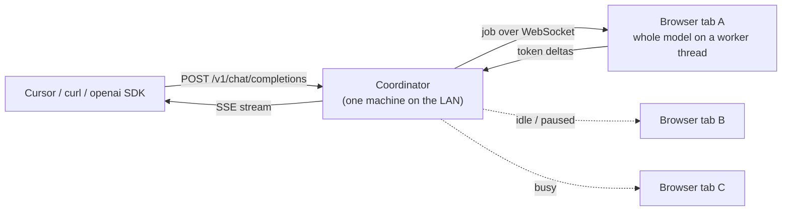
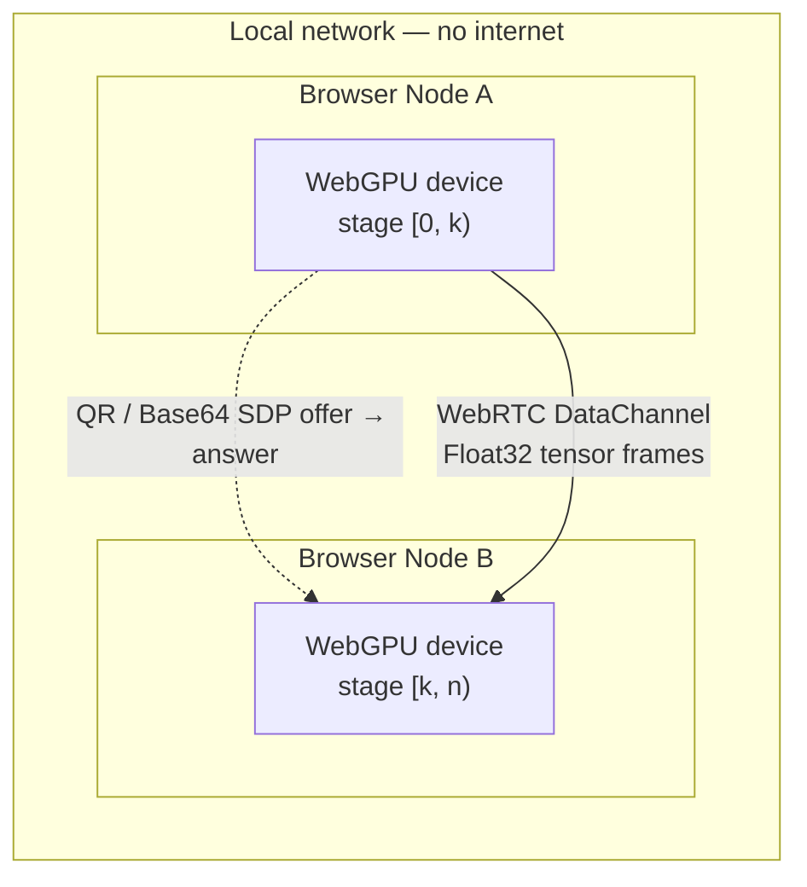

# MeshGPU

### A serverless, LAN-only tensor transport for browser GPUs

MeshGPU pairs WebGPU-capable browsers on the same local network into a
peer-to-peer mesh and streams tensors between them over WebRTC DataChannels —
with no signaling server, no cloud, and no traffic leaving your subnet. Peers
pair by scanning a QR code or copy-pasting a compressed SDP string.

MeshGPU has two modes, and they are very different in maturity:

> ### **Pool mode — works today.**
> Each contributing browser tab loads a whole model and answers requests routed
> to it by a small on-prem coordinator, which exposes an **OpenAI-compatible
> endpoint**. Point Cursor, Continue, the `openai` SDK or plain `curl` at it.
> Throughput scales with the number of people who leave the tab open, and a tab
> closing costs at most one retry. [Jump to the quickstart](#quickstart-pool-mode).
>
> ### **Shard mode — not implemented.**
> Splitting one model's layers across peers. The transport, handshake and layer
> scheduler are built and tested, but what travels between peers today comes
> from an *identity executor* that forwards tensors unchanged. No transformer
> layer executes on a remote peer. See [Roadmap](#roadmap) and
> [Honest limitations](#honest-limitations).

---

## What actually works today

| | Status | |
| --- | --- | --- |
| **Pool mode (data parallel)** | ✅ Works | Whole model per peer, requests routed to whoever is idle |
| **OpenAI-compatible endpoint** | ✅ Works | `/v1/chat/completions` streaming + non-streaming, `/v1/models` |
| **Coordinator + worker pool** | ✅ Works | Least-loaded routing, queueing, retry-on-worker-loss, heartbeats |
| **Worker-thread inference** | ✅ Works | Engine runs off the main thread, so the lender's tab stays responsive |
| **Idle policy** | ✅ Works | Pause on battery, pause while you're using the machine |
| **mDNS advertisement** | ✅ Works | Coordinator publishes `_meshgpu._tcp` |
| **WebGPU capability probing** | ✅ Works | Adapter limits, ML features, compute + bandwidth micro-benchmarks |
| **Serverless QR pairing** | ✅ Works | Full SDP + ICE compressed into one QR code or Base64 string |
| **Binary tensor transport** | ✅ Works | 32-byte framed wire format over a DataChannel, round-trip tested |
| **Layer scheduler** | ✅ Works | Deterministic, throughput-weighted, memory-capped (2 peers) |
| **Auth** | ⚠️ Basic | One shared token for the whole mesh — no per-user identity, no SSO |
| **VRAM estimation** | ⚠️ Approximate | Parsed from the adapter description; often unavailable |
| **Multi-peer shard mesh (3+)** | ❌ Not yet | Peer IDs fixed to `host`/`joiner`; a third device is unsupported |
| **Sharded inference** | ❌ Not yet | `IdentityExecutor` is the only executor in the codebase |

---

## Architecture

### Pool mode — how a request is served today



The coordinator picks the least-loaded tab that has the model loaded and is not
paused by its idle policy. It never runs a model, never sees a GPU and never
talks to the internet — prompts pass through it between two LAN endpoints and
are not persisted. If a tab closes mid-request before any token has been sent,
the job is silently reassigned; once tokens have reached the client it fails
instead, because retrying would duplicate text the reader already saw.

### Shard mode — the peer-to-peer transport

Two browser nodes pair directly and exchange tensors over a WebRTC
DataChannel. The only thing crossing the gap is a one-time SDP handshake that
you carry across by hand.



1. **Capability inspection** — each tab requests a `GPUAdapter`, reads its
   limits and features, runs a 2-second compute/bandwidth benchmark, and
   estimates how many transformer layers it could host.
2. **Manual handshake** — the host renders a room-offer QR; the joiner scans it
   and returns a guest-answer QR. ICE candidates are gathered to `complete` and
   bundled into a single compressed string. No server is involved at any point.
3. **Tensor streaming** — the first stage runs its executor, streams the result
   to the next stage, and the final stage produces an output. *Today that
   executor is the identity function.*

---

## Quickstart (Pool mode)

Prerequisites: **Node.js ≥ 18** and a WebGPU-capable browser. Chrome or Edge
stable is strongly recommended — Firefox's WebGPU dispatch overhead is roughly
30× Chrome's and is not usable for inference. WebGPU requires a secure
context; `http://localhost` qualifies.

**On one machine — start the coordinator:**

```bash
git clone https://github.com/<your-org>/mesh-gpu.git
cd mesh-gpu
npm install
npm run coordinator:install
npm run mesh
```

It prints an API key and a join link:

```
[meshgpu] coordinator listening on http://192.168.1.24:8080
[meshgpu] OpenAI endpoint:  http://192.168.1.24:8080/v1
[meshgpu] API key:          kR3xP-9Wq2vLmZ  (generated — set MESH_TOKEN to pin it)

[meshgpu] Share this link with colleagues to lend their GPU:
[meshgpu]   http://192.168.1.24:8080/?token=kR3xP-9Wq2vLmZ
```

**On every machine that will lend its GPU:** open that join link, pick a model
under **Contribute to a Mesh**, click **Load model**, then **Start
contributing**. The key is filled in from the link. The tab must stay open, but
the engine runs on a worker thread so the machine stays usable.

**From anywhere on the LAN — use it:**

```bash
curl http://192.168.1.24:8080/v1/chat/completions \
  -H "Authorization: Bearer kR3xP-9Wq2vLmZ" \
  -H "Content-Type: application/json" \
  -d '{"model":"Qwen2.5-1.5B-Instruct-q4f16_1-MLC",
       "messages":[{"role":"user","content":"hello"}],
       "stream":true}'
```

Or point any OpenAI-compatible tool at it:

```bash
export OPENAI_BASE_URL=http://192.168.1.24:8080/v1
export OPENAI_API_KEY=kR3xP-9Wq2vLmZ
```

`GET /status` shows who is on the mesh and what they are serving. `GET /healthz`
needs no key and is there for uptime checks.

### Coordinator configuration

| Variable | Default | |
| --- | --- | --- |
| `MESH_PORT` | `8080` | Listen port |
| `MESH_HOST` | `0.0.0.0` | Listen address |
| `MESH_TOKEN` | *generated* | Shared API key — pin it to keep links stable |
| `MESH_JOB_TIMEOUT_MS` | `120000` | Give up on a silent worker after this long |
| `MESH_MAX_QUEUE` | `64` | Waiting requests before returning 429 |
| `MESH_MDNS` | on | Set `off` to skip the `_meshgpu._tcp` advertisement |
| `MESH_NAME` | `MeshGPU (hostname)` | Name shown in mDNS browsers |

### Just inspecting your GPU?

```bash
npm run dev   # → http://localhost:5173
```

The dashboard probes your GPU and shows adapter limits, ML-relevant features,
estimated memory pool, and how many layers of each model profile it could host.

---

## Pairing two devices (Shard mode transport)

Pair two tabs (same machine) or two devices (same Wi-Fi) in under a minute.

### Option A — QR code camera scanning

1. Open the app in two browser tabs or devices on the **same LAN**.
2. In each, open **P2P Transport Loopback → Connect peers (QR)**.
3. **Host**: click **Generate room offer**, then hold the QR up to the other
   device's camera.
4. **Joiner**: click **Scan with camera**. The offer decodes automatically and
   a **guest answer** QR appears.
5. **Host**: click **Scan with camera** to read the guest answer and apply it.
6. The status turns **Connected**; latency and layer assignment appear once the
   DataChannels open.

### Option B — Base64 copy-paste (no camera)

1. **Host**: **Generate room offer**, then **Copy** the Base64 text and send it
   to the joiner by any means.
2. **Joiner**: paste it into **Paste/scan host offer**, click **Accept offer &
   generate answer**, copy the answer.
3. **Host**: paste the answer into **Paste/scan guest answer** and click
   **Apply guest answer**.

If camera access is denied, the modal falls back to copy-paste automatically.

Once connected, **Run loopback tensor** pushes a small `Float32Array` through
the full transport path — encode, send, receive, validate, forward, return.
This exercises the wire format end to end. It does not run a model.

---

## Honest limitations

Worth understanding before you build on this, because some of these are
properties of the approach rather than bugs to be fixed.

**Layer sharding buys capacity, not speed.** Autoregressive decode is
memory-bandwidth bound. Splitting a model across *N* machines gives each one
1/*N* of the weights to read — but also 1/*N* of the bandwidth, and the stages
run sequentially. Ten laptops running a 30B model land at roughly the same
tokens/second as one hypothetical machine that could hold the whole thing. The
win is that the model runs at all, on hardware that individually could not
hold it. Anyone promising a speedup from pipeline parallelism at batch size 1
is mistaken.

**The payoff needs concurrent users.** At batch 1, all but one stage sits idle.
With several people querying at once, every stage stays busy and aggregate
throughput scales with the number of stages. A shared office mesh is the
deployment shape where this actually pays off; one person pooling their own
laptop and desktop gains nothing.

**Bandwidth is not the bottleneck; prefill is.** A 7B model's hidden state is
about 14 KB per token per hop — roughly 7 Mbps at 20 tok/s across three hops,
which any Wi-Fi handles. Prefill is the hard part: a 2,048-token prompt is
~29 MB per hop in f32, and the current transport has no frame chunking, so
that path is not yet viable.

**Browsers are slower than native.** WebLLM reaches around 80% of native MLC
throughput on premium hardware and considerably less elsewhere; prefill lags
native by 21–51%. The browser's advantage here is deployment — no install, no
admin rights, works on a locked-down laptop — not performance. If you control
the machines, [exo](https://github.com/exo-explore/exo) and
[llama.cpp](https://github.com/ggml-org/llama.cpp) will be faster.

**VRAM estimates are approximations.** Browsers do not expose dedicated VRAM.
MeshGPU parses `GPUAdapterInfo.description` against a hardcoded device table,
falling back to `navigator.deviceMemory`. Chrome frequently returns empty
strings for these fields, in which case no estimate is available and the node
reports zero capacity. Even a correct answer overstates what a browser tab can
actually allocate — `maxBufferSize` is typically capped near 2 GiB and the
per-process GPU budget is well below the card's physical memory. Treat these
numbers as indicative.

**Pool mode needs the tab open.** A contributor who closes the tab, sleeps the
laptop, or walks out of Wi-Fi range leaves the mesh. In-flight work is retried
elsewhere, but capacity is only as reliable as people's browsing habits. This
is a real operational difference from a dedicated server and you should plan
around it rather than hope.

**One shared key, no identity.** Everyone on the mesh — every contributor and
every client — presents the same token. There is no per-user identity, no
revocation of one person without rotating for all, and no audit trail of who
asked what. That is adequate for a trusted office LAN and inadequate for
anything with a compliance requirement.

**Prompts pass through the coordinator.** In Pool mode the request path is
client → coordinator → browser tab. Everything stays on the LAN, and nothing is
written to disk, but the coordinator process does see prompt text in memory.
The stronger "not even the coordinator sees it" property belongs to the
peer-to-peer shard path, which does not do real inference yet.

**Shard-mode pairing is unauthenticated.** Anyone who can see or photograph the
offer QR can join. There is no shared secret, no peer identity, and no
revocation on that path. Use it only on networks and with people you trust.

---

## Privacy properties

What MeshGPU does and does not guarantee, stated precisely:

- **No signaling server.** Offers and answers move between browsers by QR code
  or clipboard. There is no room registry and no message relay.
- **Host candidates only.** The manual handshake uses `{ iceServers: [] }`, so
  the DataChannel connects over your local subnet without contacting STUN or
  TURN. *(`DEFAULT_RTC_CONFIG` in the codebase does reference a public STUN
  server; it is reachable only from the mock-transport test path, never from
  the QR handshake the app actually uses.)*
- **Model weights stay local.** Weights are downloaded to the device that runs
  them. Only tensor frames move between peers, and only within the LAN.
- **Source-available under AGPL-3.0.** Hosting a modified MeshGPU as a network
  service requires releasing your changes.

Security is a process, not a promise. Browser extensions, devtools and
OS-level observers are out of scope. MeshGPU can only speak for what its own
runtime transmits — and, on the QR path, that is nothing beyond your subnet.

---

## Roadmap

Ordered by what unblocks the most.

**Done — Pool mode.** Data parallelism with an OpenAI-compatible endpoint. It
scales with the number of contributors, tolerates a machine disappearing
mid-request, and needs no tensor streaming.

**Next — make the mesh governable.** Per-user identity instead of one shared
token, an audit log, per-user quotas, a model allowlist, and a coordinator
admin view. This is what turns a useful tool into something an organisation can
actually adopt.

**Then — transport hardening.** Frame chunking and an f16 wire format so
prefill-sized tensors survive the DataChannel; retransmit deadlines so a
dropped frame cannot stall a forward pass indefinitely; honouring the
backpressure signal instead of dropping frames silently.

**Then — real sharded inference.** WebLLM's public API runs whole models and
cannot express per-layer execution, so this means ONNX Runtime Web with a
manually split graph, or a purpose-built WGSL kernel set — plus a sharded KV
cache, which is the part most people underestimate.

**Also needed** — mesh support beyond two peers with real peer identities and
capacity gossip; authenticated pairing; empirical memory probing to replace the
device lookup table; microbatching so concurrent requests fill the pipeline.

---

## Technical stack

| Layer | Technology |
| ----- | ---------- |
| UI & runtime | **React 18 + Vite 5**, Tailwind CSS |
| Language | **TypeScript** (strict) |
| Compute | **WebGPU** (`@webgpu/types`) — benchmark kernels + executor interface |
| Reference inference | **@mlc-ai/web-llm** (single-node only) |
| Coordinator | **Node ≥ 18**, `ws`, `bonjour-service` — no build step |
| Peer transport | **WebRTC DataChannels** (ordered control + unordered tensor) |
| Handshake | Manual SDP exchange compressed with **LZ-String** |
| QR | **qrcode.react** (render) + **html5-qrcode** (camera scan) |
| Testing | **Vitest** (unit) + **Playwright** with an in-memory MockTransport |

```
src/
├── engine/
│   ├── webgpu-node.ts       # Adapter inspection, VRAM estimation, benchmarks
│   ├── manual-signaling.ts  # Manual WebRTC SDP exchange (QR / Base64)
│   ├── signaling.ts         # Transport-agnostic signaling contracts
│   ├── p2p-pipeline.ts      # DataChannel tensor streaming + forwarding
│   ├── scheduler.ts         # Deterministic throughput-weighted assignment
│   ├── mock-transport.ts    # In-memory RTC mock (headless tests)
│   ├── web-llm.ts           # WebLLM runtime (worker-threaded)
│   ├── scheduler.test.ts    # Scheduler invariants + randomised properties
│   ├── tensor-codec.test.ts # Wire format round-trip + malformed-input tests
│   ├── mesh-worker.ts       # Pool mode: run coordinator jobs in this tab
│   ├── webllm-worker.ts     # Web Worker host for the WebLLM engine
│   ├── idle-policy.ts       # Battery / activity rules for contributing
│   └── mesh-worker.test.ts  # Coordinator URL construction
├── components/
│   ├── ContributeCard.tsx   # Pool mode UI: load a model, lend the GPU
│   ├── QRHandshakeModal.tsx # Host/joiner QR handshake workflow
│   ├── TopologyGraph.tsx    # Canvas node graph: peers, stages, VRAM, RTT
│   ├── VramGauge.tsx        # Semicircular memory gauge
│   └── ChatUI.tsx           # Local streaming chat (WebLLM, single node)
└── App.tsx

coordinator/
├── server.js                # HTTP + WebSocket + mDNS, serves dist/
├── lib/
│   ├── registry.js          # Worker pool: readiness, pausing, least-loaded pick
│   ├── queue.js             # Job routing, queueing, timeouts, retry-on-loss
│   ├── openai.js            # Request validation + OpenAI response shapes
│   └── auth.js              # Shared-token check (constant time)
└── test/                    # Unit + full HTTP/WebSocket integration tests
```

---

## Development

```bash
npm install
npm run coordinator:install  # coordinator deps (ws, bonjour-service)

npm run typecheck            # tsc --noEmit (app + node configs)
npm test                     # Vitest: client units + coordinator unit & integration
npm run test:e2e:manual      # Playwright: manual handshake + MockTransport streaming
npm run build                # typecheck + production build → dist/

npm run mesh                 # build, then serve the frontend + coordinator
npm run coordinator          # coordinator only (expects an existing dist/)
```

The coordinator integration suite starts a real HTTP server, connects a fake
WebSocket worker, and drives the OpenAI endpoint end to end — so routing,
streaming, auth and failover are covered without a GPU or a model download.

Enable the in-memory mock transport (no real WebRTC) with `?mockP2P=true` or
`VITE_USE_MOCK_P2P=true` — used by the **Mock P2P Mesh** demo card and the
headless CI suite.

## Contributing

Please read [CONTRIBUTING.md](CONTRIBUTING.md) before opening a pull request.
Contributions require agreeing to the
[Contributor License Agreement](CLA.md).

The most valuable contributions right now are the roadmap items above,
especially anything that makes a real model execute across two peers.

## License

MeshGPU is licensed under the **GNU Affero General Public License v3.0
(AGPL-3.0-only)**. See [LICENSE](LICENSE) for the full text.
